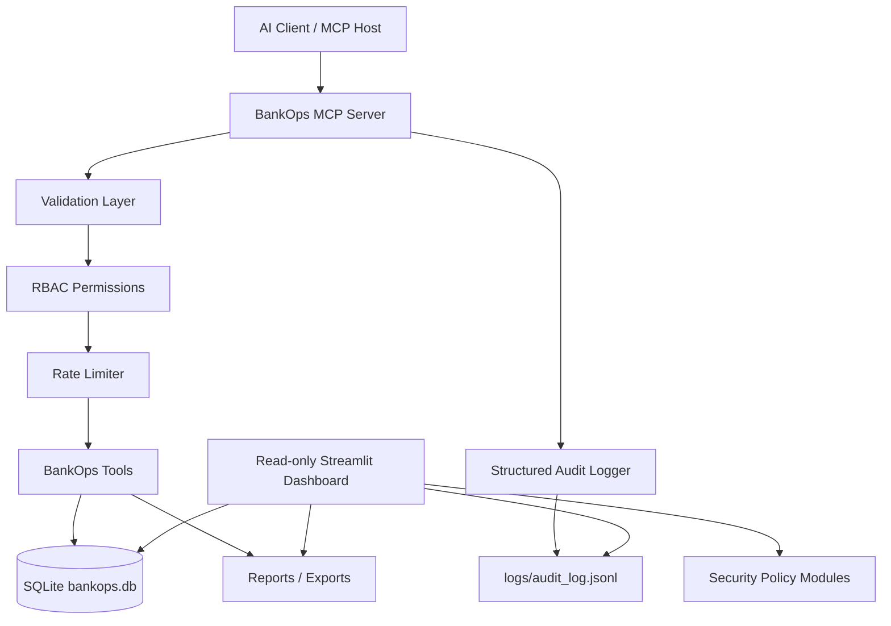
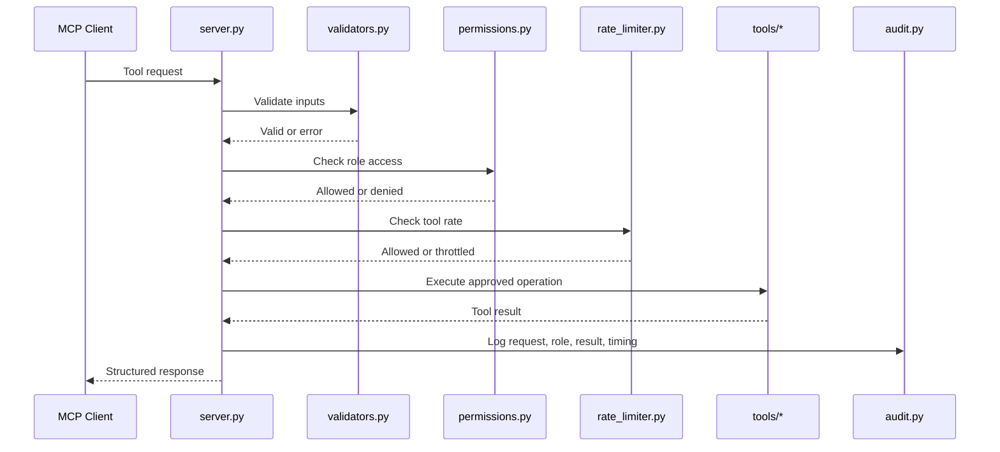

# BankOps AI MCP Server

Secure AI banking operations control plane built with Python, SQLite, the Model Context Protocol, and a read-only Streamlit executive dashboard.

BankOps AI demonstrates how an AI assistant can safely operate inside a banking operations environment without being given arbitrary database access. The MCP server exposes only predefined, validated tools. Every tool call passes through role-based access control, rate limiting, structured responses, audit logging, and sensitive-data masking. The dashboard provides executive visibility over the same operational data while remaining strictly read-only.

## Screenshots

The repository includes dashboard and MCP screenshots in the existing `Assests/` directory. The folder name is intentionally referenced as it exists in the project.

### Executive Dashboard


### MCP Tooling


## What This Project Does

BankOps AI is a secure operations layer for common banking support and finance workflows:

- Inspect failed transactions for a specific date.
- Summarize transaction status and amounts.
- Check a customer's payment status with role-aware masking.
- Open support tickets through controlled MCP tools.
- Search and inspect audit logs.
- Detect failed-transaction spikes.
- Generate daily operations reports.
- Export failed transactions to CSV.
- Run a failed-transaction incident workflow.
- Track workflow runs.
- Display security policy and rate-limit configuration.
- Monitor all of the above through a polished read-only dashboard.

The important design point: the AI does not receive arbitrary SQL access. It can only call server-defined MCP tools, and each tool has validation, permission checks, rate limiting, structured responses, and audit logging.

## Project Goals

This project was designed to answer practical questions about safe AI operations in a banking context:

- How can an LLM help with operations without direct database access?
- How can tool calls be restricted by role?
- How can sensitive customer data be masked?
- How can every AI action be traceable?
- How can operational workflows be visible to management?
- How can a dashboard provide executive visibility without triggering actions?
- How can demo data look realistic without fake linear placeholder charts?

## Architecture



## Repository Structure

```text
bankops-mcp-server/
├── server.py                         # MCP server and tool registration
├── requirements.txt                  # Python dependencies
├── README.md                         # Project documentation
├── .streamlit/
│   └── config.toml                   # Light dashboard theme
├── Assests/
│   ├── dashboard/                    # Dashboard screenshots
│   └── mcp/                          # MCP screenshots
├── dashboard/
│   └── app.py                        # Read-only executive dashboard
├── database/
│   ├── bankops.db                    # SQLite operational database
│   ├── seed_data.py                  # Base schema and seed data
│   ├── seed_more_transactions.py     # Additional transaction seed data
│   └── seed_demo_timeseries.py       # Non-linear demo time-series data
├── exports/                          # Generated CSV exports
├── logs/
│   └── audit_log.jsonl               # Structured audit trail
├── reports/                          # Generated JSON reports
├── security/
│   ├── masking.py                    # Sensitive-data masking helpers
│   ├── permissions.py                # Role-to-tool permissions
│   ├── rate_limiter.py               # In-memory rate limiting
│   ├── responses.py                  # Standard response envelopes
│   ├── security_policy.py            # Security policy summary
│   └── validators.py                 # Input validation
├── tools/
│   ├── audit.py                      # Audit log read/search and write helpers
│   ├── automations.py                # Spike detection automation
│   ├── customers.py                  # Customer payment status lookup
│   ├── exports.py                    # CSV export generation
│   ├── incidents.py                  # Incident workflow orchestration
│   ├── reports.py                    # Daily operations report generation
│   ├── tickets.py                    # Support ticket creation
│   ├── transactions.py               # Transaction queries
│   └── workflows.py                  # Workflow run tracking
└── tests/
    └── test_tools.py                 # Tool-level tests
```

## Quick Start

### 1. Create and activate a virtual environment

```powershell
py -m venv .venv
.venv\Scripts\Activate.ps1
```

### 2. Install dependencies

```powershell
pip install -r requirements.txt
```

### 3. Seed the database

Base schema and seed data:

```powershell
py database\seed_data.py
```

Optional extra transaction records:

```powershell
py database\seed_more_transactions.py
```

Recommended demo time-series data for polished dashboard charts:

```powershell
py database\seed_demo_timeseries.py
```

### 4. Run the dashboard

```powershell
py -m streamlit run dashboard/app.py
```

Then open:

```text
http://localhost:8501
```

### 5. Run tests

```powershell
pytest
```

## Running the MCP Server

The MCP server is defined in `server.py` using `FastMCP`.

Depending on your MCP client setup, point the client at this project and run the server module through Python. A typical local command is:

```powershell
py server.py
```

If your client uses a JSON MCP config, configure the command to start Python in this directory and run `server.py`.

## MCP Tools

The server exposes a curated set of tools. The LLM cannot call arbitrary SQL.

| MCP Tool | Python Function | Purpose |
| --- | --- | --- |
| `failed_transactions` | `tools.transactions.get_failed_transactions` | Return failed transactions for a date. |
| `transaction_summary` | `tools.transactions.get_transaction_summary` | Aggregate counts and amounts by status. |
| `customer_payment_status` | `tools.customers.get_customer_payment_status` | Return latest payment status for a customer. |
| `open_support_ticket` | `tools.tickets.create_support_ticket` | Create a support ticket with validated input. |
| `audit_logs` | `tools.audit.get_audit_logs` | Return recent audit events. |
| `search_audit_logs` | `tools.audit.search_audit_logs` | Search audit events by tool, role, status, and error type. |
| `detect_failed_transaction_spike` | `tools.automations.detect_failed_transaction_spike` | Detect unusual failed-transaction volume. |
| `get_workflow_runs` | `tools.workflows.search_workflow_runs` | Inspect workflow runs. |
| `failed_transactions_csv_export` | `tools.exports.export_failed_transactions_csv` | Generate a CSV export for failed transactions. |
| `failed_transaction_incident_workflow` | `tools.incidents.run_failed_transaction_incident_workflow` | Run an incident workflow for failed transactions. |
| `daily_ops_report` | `tools.reports.generate_daily_ops_report` | Generate a JSON daily operations report. |
| `security_policy` | `security.security_policy.get_security_policy` | Return the security policy summary. |

## Security Model

Security is handled before business logic runs.



### Role-Based Access Control

Defined in `security/permissions.py`.

Roles include:

- `support_agent`
- `finance_manager`
- `admin`
- `auditor`

Each role receives only the tools it needs. For example, a support agent can check customer payment status and open tickets, while an auditor can inspect audit/security data without operational write actions.

### Rate Limiting

Defined in `security/rate_limiter.py`.

The rate limiter protects individual role/tool pairs. Example:

- `support_agent` can call `customer_payment_status` 5 times per 60 seconds.
- `support_agent` can call `open_support_ticket` 3 times per 60 seconds.
- `admin` receives higher limits for operational tools.
- `auditor` receives limits suitable for audit review.

### Input Validation

Defined in `security/validators.py`.

Validation covers:

- Date format: `YYYY-MM-DD`
- Customer IDs: `CUST001` style
- Ticket priorities: `low`, `medium`, `high`, `critical`
- Text field lengths
- Audit search filters
- Workflow filters
- Limits and thresholds

Bad input returns a structured `VALIDATION_ERROR` response and is logged.

### Sensitive-Data Masking

Defined in `security/masking.py`.

The server masks customer data based on role. This keeps the demo realistic: different users can receive different views of customer details depending on authorization.

### Structured Responses

Defined in `security/responses.py`.

Every tool response is wrapped consistently with:

- `status`
- `tool_name`
- `request_id`
- `data` or `message`
- optional `error_type`
- optional `details`

This makes the output predictable for clients and easier to audit.

### Audit Logging

Defined in `tools/audit.py`.

Every tool call is logged to:

```text
logs/audit_log.jsonl
```

Audit events include:

- timestamp
- request ID
- tool name
- role
- status
- error type
- sanitized input
- output preview
- execution time

Sensitive values are masked or reduced in previews.

## Dashboard

The dashboard is located at:

```text
dashboard/app.py
```

It is a monitoring and executive visibility layer. It is intentionally read-only:

- It does not trigger workflows.
- It does not call MCP tools.
- It does not create tickets.
- It does not generate reports.
- It does not mutate the database.
- It does not write audit logs.
- It reads from existing database, audit, report, export, and security-policy files.

### Dashboard Pages

| Page | Purpose |
| --- | --- |
| Overview | Executive KPIs, platform health, time-series trends, recent failed transactions, workflows, audit snapshot, recent artifacts. |
| Transactions | Transaction KPIs, status summaries, failed-transaction highlights, detailed read-only ledger. |
| Tickets | Ticket KPIs and card-first support case review. |
| Workflow Runs | Workflow status cards, filters, and detailed workflow table. |
| Audit Logs | Audit event feed with technical details collapsed in expanders. |
| Reports & Exports | Document-library layout for JSON reports and CSV exports. |
| Security Policy | RBAC summary, permission matrix, rate limits, and control framework. |

### Dashboard Design

The dashboard uses a light enterprise SaaS style:

- background: `#F6F8FB`
- cards: `#FFFFFF`
- borders: `#E5EAF1`
- primary text: `#0F172A`
- secondary text: `#64748B`
- accent colors for success, warning, error, info, and security states

The dashboard uses:

- KPI cards
- status chips
- workflow cards
- audit event cards
- report cards
- empty states
- timeline-style audit entries
- collapsible technical details

Raw JSON and technical previews are hidden inside labelled expanders so the executive UI does not look like a code dump.

### Operations Overview Charts

The Overview charts use grouped real data, not placeholder sequences.

The dashboard parses both:

- date-only strings such as `2026-06-10`
- ISO timestamps such as `2026-06-10T09:15:00`
- timezone-aware ISO timestamps

Charts include:

- Transaction Volume by date
- Failed Transaction Rate by date
- Workflow Executions by date
- Audit Errors by date

If there is not enough time-series data, the dashboard shows a polished empty state instead of drawing a fake straight line.

## Demo Time-Series Data

The script `database/seed_demo_timeseries.py` creates realistic non-linear demo data.

It inserts or replaces:

- 30 customers
- 300 demo transactions
- 14 days of timestamps
- mixed transaction statuses
- varied failure reasons
- varied workflow runs
- varied audit log events

Run:

```powershell
py database\seed_demo_timeseries.py
```

This makes the dashboard charts show natural rises, dips, spikes, and variation.

The script uses deterministic IDs:

- `TXN-DEMO-0001`
- `WF-DEMO-0001`
- `REQ-DEMO-0001`

That means the script can be run repeatedly without endlessly duplicating demo records.

## Database Schema

SQLite database:

```text
database/bankops.db
```

Main tables:

### `customers`

| Column | Type | Purpose |
| --- | --- | --- |
| `customer_id` | TEXT | Primary customer identifier. |
| `full_name` | TEXT | Customer name. |
| `email` | TEXT | Customer email. |
| `risk_level` | TEXT | Low, medium, or high risk indicator. |

### `transactions`

| Column | Type | Purpose |
| --- | --- | --- |
| `transaction_id` | TEXT | Primary transaction identifier. |
| `customer_id` | TEXT | Linked customer ID. |
| `amount` | REAL | Transaction amount. |
| `currency` | TEXT | Currency, usually `ZAR`. |
| `status` | TEXT | `successful`, `failed`, or `pending`. |
| `failure_reason` | TEXT | Failure explanation if status is failed. |
| `created_at` | TEXT | Date or ISO timestamp. |

### `support_tickets`

| Column | Type | Purpose |
| --- | --- | --- |
| `ticket_id` | TEXT | Primary ticket identifier. |
| `title` | TEXT | Ticket title. |
| `priority` | TEXT | Priority level. |
| `description` | TEXT | Ticket detail. |
| `status` | TEXT | Ticket status. |
| `created_at` | TEXT | Creation timestamp. |

### `workflow_runs`

| Column | Type | Purpose |
| --- | --- | --- |
| `workflow_id` | TEXT | Primary workflow run ID. |
| `workflow_name` | TEXT | Workflow name. |
| `status` | TEXT | `started`, `completed`, `failed`, `no_action_required`. |
| `started_at` | TEXT | Start timestamp. |
| `completed_at` | TEXT | Completion timestamp. |
| `triggered_by_role` | TEXT | Role that initiated the workflow. |
| `summary` | TEXT | Human-readable run summary. |

## Module Breakdown

### `server.py`

The central MCP entrypoint. It:

- registers MCP tools
- normalizes unusual client payload shapes
- validates inputs before execution
- checks RBAC permissions
- checks rate limits
- runs approved tools
- wraps results in structured responses
- logs all calls with timing

### `tools/transactions.py`

Provides transaction queries:

- failed transactions by date
- transaction summary by date and status

### `tools/customers.py`

Looks up a customer's payment status. The server layer applies role-based masking before returning customer records.

### `tools/tickets.py`

Creates support tickets. This is available only through the MCP tool path, not through the dashboard.

### `tools/audit.py`

Handles audit writing and read/search operations. It sanitizes inputs and output previews so logs remain useful without exposing sensitive raw data.

### `tools/automations.py`

Contains failed-transaction spike detection. This is a controlled automation helper, not arbitrary AI logic.

### `tools/workflows.py`

Tracks workflow lifecycle:

- start
- complete
- fail
- mark no action required
- search/retrieve workflow runs

### `tools/reports.py`

Generates JSON reports into:

```text
reports/
```

### `tools/exports.py`

Generates CSV exports into:

```text
exports/
```

### `tools/incidents.py`

Coordinates a failed-transaction incident workflow. It uses workflow tracking, report generation, ticket creation, and exports in a controlled server-side path.

### `security/permissions.py`

Defines which roles can access which tools.

### `security/rate_limiter.py`

Defines per-role/per-tool limits and tracks recent calls in memory.

### `security/validators.py`

Defines all input validators used before tool execution.

### `security/masking.py`

Masks sensitive customer fields according to role.

### `security/responses.py`

Creates consistent success/error response envelopes and request IDs.

### `security/security_policy.py`

Returns a structured summary of the project's security model.

### `dashboard/app.py`

Provides a polished read-only dashboard for:

- operations overview
- transactions
- tickets
- workflow runs
- audit logs
- reports and exports
- security policy

It is deliberately separate from the MCP action layer.

## Reports and Exports

Reports are JSON files written under:

```text
reports/
```

Exports are CSV files written under:

```text
exports/
```

The dashboard reads these files as a document library. It does not generate new reports or exports.

## Read-Only Dashboard Guarantee

The dashboard is intentionally implemented as a visibility layer.

Allowed dashboard behavior:

- read SQLite tables
- read audit log JSONL
- read reports
- read exports
- read security policy constants
- render charts, cards, tables, and expanders

Forbidden dashboard behavior:

- calling MCP tools
- triggering workflows
- creating tickets
- generating reports
- creating exports
- mutating the database
- writing audit logs
- modifying operational files

This separation keeps the executive dashboard safe to open during demos and reviews.

## Demo Workflow

For a fresh demo:

```powershell
py database\seed_data.py
py database\seed_more_transactions.py
py database\seed_demo_timeseries.py
py -m streamlit run dashboard/app.py
```

Then open:

```text
http://localhost:8501
```

Recommended dashboard review path:

1. Start on Overview to show the control-plane posture.
2. Open Transaction Volume and Failed Rate tabs to show non-linear time-series trends.
3. Open Transactions to show failed transaction highlights and detailed ledger.
4. Open Workflow Runs to show automation traceability.
5. Open Audit Logs to show the event feed and collapsed technical details.
6. Open Reports & Exports to show evidence artifacts.
7. Open Security Policy to show RBAC, rate limits, and control framework.

## Testing

Run all tests:

```powershell
pytest
```

Run a syntax check:

```powershell
py -m py_compile server.py dashboard\app.py database\seed_demo_timeseries.py
```

## Troubleshooting

### Dashboard charts look flat

Run the demo time-series seed:

```powershell
py database\seed_demo_timeseries.py
```

Refresh the Streamlit page.

### Dashboard shows stale data

Streamlit caches read-only data briefly with `@st.cache_data(ttl=10)`. Wait a few seconds and refresh, or restart Streamlit.

### Streamlit port already in use

Run on another port:

```powershell
py -m streamlit run dashboard/app.py --server.port 8502
```

### MCP access denied

Check the role passed to the tool and compare it to `security/permissions.py`.

### Rate limit exceeded

Wait for the configured window to reset or inspect `security/rate_limiter.py`.

### Invalid input

Review validators in `security/validators.py`. The tool will return a structured validation error and write an audit entry.

## Design Notes

This project intentionally avoids unsafe shortcuts:

- no arbitrary SQL tool
- no direct dashboard actions
- no hidden operational mutations in UI code
- no raw JSON in executive views by default
- no fake linear dashboard chart placeholders
- no dark table-first dashboard layout

The AI-facing surface area is narrow and explicit. The dashboard-facing surface area is read-only and presentation focused. That is the core design boundary of the project.

## Limitations

- The rate limiter is in-memory, so limits reset when the server restarts.
- SQLite is used for local demo portability rather than production concurrency.
- The audit log is JSONL on disk for readability and simplicity.
- Demo data is deterministic and realistic-looking, but not real banking data.
- The dashboard is not an authentication boundary; it is a local monitoring UI for this project.

## Roadmap Ideas

Potential future improvements:

- persist rate-limit state in SQLite or Redis
- add authentication around the dashboard
- add unit tests for dashboard aggregation helpers
- add richer report schemas
- add deployment configuration for a containerized demo
- add role-switchable masked customer previews in a controlled test view
- add a formal OpenAPI-style catalog for MCP tools

